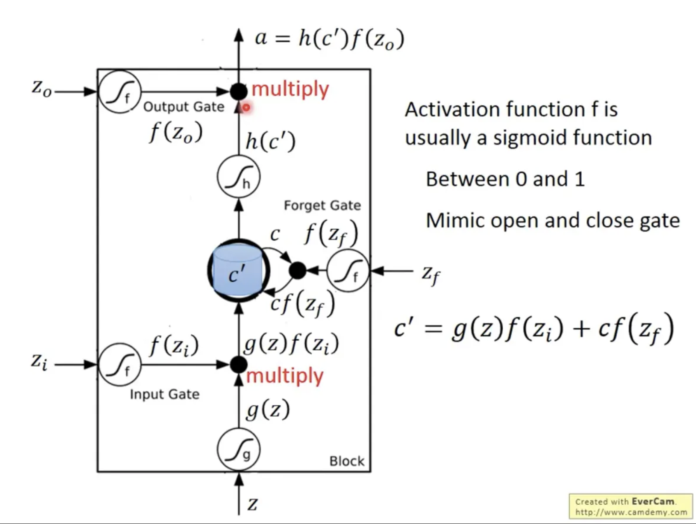

## LSTM (Long Short-Term Memory)

長短期記憶網路（LSTM）是對 RNN 的改進，專門用來解決梯度消失問題。它在結構中引入了「記憶單元」與「閘門機制」，能有效地在長序列中保存或忘卻資訊。

**核心組成**：

1. **遺忘閘門 (Forget Gate)**：決定哪些資訊需要被丟棄。

1. **輸入閘門 (Input Gate)**：決定哪些新資訊需要被寫入記憶單元。

1. **輸出閘門 (Output Gate)**：決定輸出多少記憶給下一個狀態。

### **1.** **輸入部分**

- **z**：輸入資料進來，先經過一個非線性轉換（通常用 tanh），得到候選值 $g(z)$。

- **Input Gate (輸入閘門)**：對應 $z_i$，經過 sigmoid function → $f(zi)$。

  - 這個值介於 0 ~ 1，代表要「開多少門」讓新資訊進去。

- **作用**：把 $g(z)$ 和 $f(z_i)$ 相乘 → $g(z)f(z_i)$。

  - 如果 $f(z_i)$ 很小（接近 0），代表不讓新資訊進來。
  - 如果 $f(z_i)$ 接近 1，代表完全接收新資訊。

### **2.** **Forget Gate (遺忘閘門)**
  - **輸入 $z_f$**，經 sigmoid function → $f(z_f)$。
  - 用來決定「上一輪的記憶 $c$」要保留多少。
  - 公式：$cf(z_f)$ → 舊記憶乘上遺忘比例。
    - 如果 $f(z_f)$ ≈ 1 → 幾乎完整保留舊記憶。
    - 如果 $f(z_f)$ ≈ 0 → 完全丟掉舊記憶。

### 3. 更新記憶 Cell

​	$c' = g(z)f(zi) + cf(zf)$

> $c'$ 就是新的記憶單元，包含「篩選後的新資訊」和「被保留的舊資訊」。

#### 4. Output Gate (輸出閘門)

- 輸入 $z_o$，經 sigmoid function -> $f(z_o)$。

- 決定要把多少記憶輸出。

- 公式：

  $ a = h(c') f(z_o)$

  - 先對記憶 $c'$ 做一個非線性轉換 $h(c')$（通常是 tanh），
  - 再乘上 $f(z_o)$，得到最後的輸出 $a$。