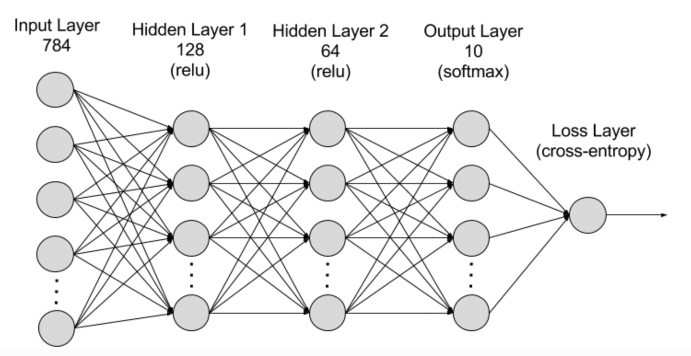

# What is RNN?

遞迴式神經網路 (RNN) 是一種深度學習模型，此模型被訓練來處理並將循序資料輸入轉換為特定的循序資料輸出。循序資料是指其序列組成部分根據複雜的語義和語法規則相互關聯的一種資料，例如單字、文句或時間序列資料。RNN 是一種軟體系統，由許多互連元件組成，模仿人類執行循序資料轉換的方式，例如將文本從一種語言翻譯為另一種語言。由於以轉換器為基礎的人工智慧 (AI) 和大型語言模型 (LLM) 處理循序資料的效率高上許多，因此在很大程度上取代了 RNN。

### 運作方式

> RNN 由神經元組成：一同執行複雜任務的資料處理節點。神經元組織為輸入層、輸出層和隱藏層。輸入層負責接收要處理的資訊，輸出層則提供結果。資料處理、分析和預測會在隱藏層中進行。

RNN 的運作方式為，接收當前序列資料並傳送給隱藏層，一次完成一步。但是他也有自我循環或循環工作流程：隱藏層可以記住並運用先前的輸入內容，在短期記憶元件中進行未來預測。其使用當前輸入和儲存的記憶內容來預測下一筆資料。
